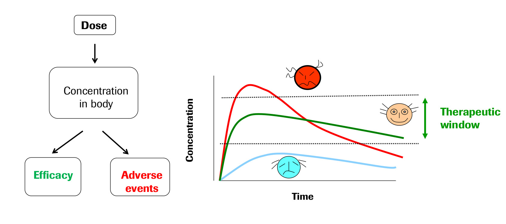

# Pharmokinetic Modelling

The field of Pharmokinetics (PK) provides a quantitative basis for describing the 
delivery of a drug to a patient, the diffusion of that drug through the plasma/body 
tissue, and the subsequent clearence of the drug from the patient's system. PK is used 
to ensure that there is sufficient concentration of the drug to maintain the required 
effecicy of the drug, while ensuring that the concentration levels remain below the 
toxic threshold (See Fig 1). Pharmokinetic (PK) models are often combined with 
Pharmodynamic (PD) models, which model the positive effects of the drug, such as the 
binding of a drug to the biological target, and/or undesirable side effects, to form a 
full PKPD model of the drug-body interaction. This project will only focus on PK, 
neglecting the interaction with a PD model.

PK enables the following processes to be quantified:

- Absorption
- Distribution
- Metabolism
- Excretion

These are often referred to as ADME, and taken together discribe the drug concentration 
in the body when medicine is prescribed. These ADME processes are typically described by 
zeroth-order or first-order *rate* reactions modelling the dynamics of the quantity of 
drug $q$, with a given rate parameter $k$, for example:

$$
\frac{dq}{dt} = -k^*,
$$

$$
\frac{dq}{dt} = -k q.
$$

The body itself is modelled as one or more *compartments*, each of which is defined as a 
kinetically homogenous unit (these compartments do not relate to specific organs in the 
body, unlike Physiologically based pharmacokinetic, PBPK, modeling). There is typically 
a main *central* compartment into which the drug is administered and from which the drug 
is excreated from the body, combined with zero or more *peripheral* compartments to 
which the drug can be distributed to/from the central compartment (See Fig 2). Each 
peripheral compartments is only connected to the central compartment.

The following example PK model describes the two-compartment model shown diagramatically 
in Fig 2. The time-dependent variables to be solved are the drug quantity in the central 
and peripheral compartments, $q_c$ and $q_{p1}$ (units: [ng]) respectivly.

$$
\frac{dq_c}{dt} = \text{Dose}(t) - \frac{q_c}{V_c} CL 
- Q_{p1} \left ( \frac{q_c}{V_c} - \frac{q_{p1}}{V_{p1}} \right ),
$$

$$
\frac{dq_{p1}}{dt} =  Q_{p1} \left ( \frac{q_c}{V_c} - \frac{q_{p1}}{V_{p1}} \right ).
$$

This model describes an *intravenious bolus* dosing protocol, with a linear clearence 
from the central compartment (non-linear clearence processes are also possible, but not 
considered here). The input paramters to the model are:
- The dose function $\text{Dose}(t)$, which could consist of instantaneous doses of $X$ 
  ng of the drug at one or more time points, or a steady application of $X$ ng per hour 
  over a given time period, or some combination.
- $V_c$ [mL], the volume of the central compartment
- $V_{p1}$ [mL], the volume of the first peripheral compartment
- $V_{p1}$ [mL], the volume of the peripheral compartment 1
- $CL$ [mL/h], the clearance/elimination rate from the central compartment
- $Q_{p1}$ [mL/h], the transition rate between central compartment and peripheral 
  compartment 1

Another example model we will show uses *subcutaneous* dosing, and adds an additional 
compartment from which the drug is absorbed to the central compartment:

$$
\frac{dq_0}{dt} = \text{Dose}(t) - k_a q_0,
$$

$$
\frac{dq_c}{dt} = k_a q_0  - \frac{q_c}{V_c} CL 
- Q_{p1} \left ( \frac{q_c}{V_c} - \frac{q_{p1}}{V_{p1}} \right ),
$$

$$
\frac{dq_{p1}}{dt} =  Q_{p1} \left ( \frac{q_c}{V_c} - \frac{q_{p1}}{V_{p1}} \right ),
$$

where $k_a$ [/h] is the “absorption” rate for the s.c dosing.

> ## Project Description
>
> Your group project is to design and implement a python library that can specify, solve 
> and visualise the solution of a PK model. You might find it helpful to base this on a 
> "starter" repository which you can clone from 
> [https://github.com/sabs-r3/2020-software-engineering-projects-pk](https://github.com/sabs-r3/2020-software-engineering-projects-pk). 
>This contains a basic Python script that constructs a two-compartment PK model with 
>i.v. dosing, solves it using the Scipy 
>[`solve_ivp`](https://docs.scipy.org/doc/scipy/reference/generated/scipy.integrate.solve_ivp.html) 
>ODE solver, and then plots the results using [`Matplotlib`](https://matplotlib.org/). 
>It also contains the framework of a basic python package that can be installed using 
>`pip`. This package uses the `unittest` testing framework, and defines a few classes 
>`Model`, `Protocol`, and `Solution`. Note that you can feel free to use as much or as 
>little of this template repository as you like, it is a suggestion based on a specific 
>set of design decisions, and many other choices could be equal or superior to those 
>chosen in the provided template.
> Your PK modelling library should ideally have the following functionality:
> - pip installable
> - github repository, with issues + PRs that fully document the development process
> - unit testing with a good test coverage
> - fully documented, e.g. README,  API documentation, OS license 
> - continuous integration (e.g. Github actions) for automatic testing and documentation 
>   generation
> - The ability to specify the form of the PK model, including the number of peripheral 
    compartments, the type of dosing (bolus versus intravenious), and the dosing 
    protocol. 
> - Users can specify the protocol independently from the model (e.g. be 
    able to solve a one and two compartment model for the same dosing protocol)
> - Ability to solve for the drug quantity in each compartment over time, given a model 
>   and a protocol
> - Ability to visualise the solution of a model, and to compare two different 
    solutions.  
> - Something else? Feel free to suggest alternative features.
>
{: .challenge}

> ## Numerical solution of ODEs using Scipy
>
> In the starter template, Scipy's 
> [`solve_ivp`](https://docs.scipy.org/doc/scipy/reference/generated/scipy.integrate.solve_ivp.html) 
is used to solve the set of ODE equations that define the PK model. Since we are using 
linear PK, we could have used analytical solutions, but relying on an ODE solver allows 
us to be more flexible if we wish to include non-linear models in the future. In 
addition, you will need to be able to numerically solve ODE models for the Mathematical 
Modelling module in weeks 6-7, so take this time to become familiar with how to use 
`solve_ivp`.
{: .callout}

## Structure of the project days

Each project team is free to organise their interaction according to what works best for 
the group. The one scheduled activiy is a daily 30 min "stand-up" meeting (to be 
scheduled) for each group with the module coordinator ([Martin 
Robinson](mailto:martin.robinson@cs.ox.ac.uk)) and demonstrators.

## Hand-in

Nothing needs to be physically handed-in for this assessment other than a URL for the 
GitHub repository for each group. Your feedback and assessment for the software 
engineering module will be based on this repository: the source code contained within, 
the generated documentation, and the content of the issues and pull requests. The source 
code should be conform to a consistent style throughout, and docstrings & comments 
should be approprate so that the code can be easily read and understood. The 
docuementation should be sufficient so that a new user could easily use the library. The 
issues and pull requests should be sufficiently detailed so that a developer could have 
joined the project half-way through and get up-to-speed on the current state of 
development and what needs to be done.



